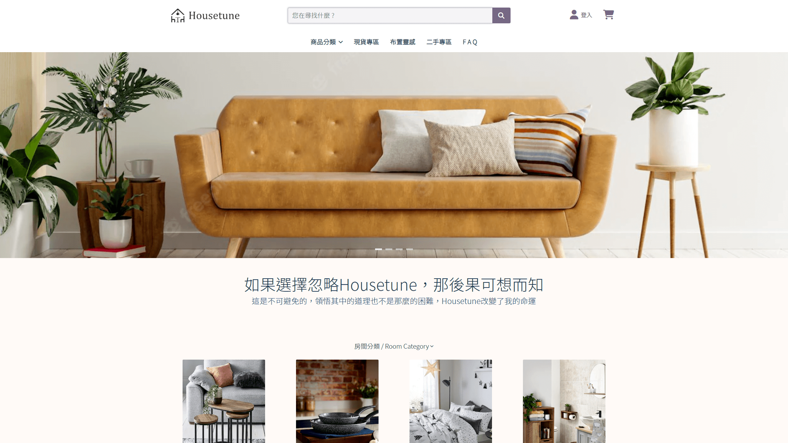

# Housetune 歐風傢具專案

## 專案概述

Housetune 為線上傢具電商網站，以優雅、簡約的商品為主，並提供二手專區讓會員上架或購買二手商品。

## 網頁預覽

   
   
>*此專案須配合資料庫以及後端專案，並在本地端( localhost )才能執行。
>點此查看後端專案。
https://github.com/housetune123/housetune-be*
## 網站功能
1. 會員系統 : 註冊、登入、瀏覽訂單、修改個人資料。
2. 評論系統 : 會員可以評價產品或賣家。 
3. 收藏系統 : 將喜歡的商品加入收藏。   
4. 產品列表 : 提供搜尋、排序、篩選等功能，尋找想購買的產品。
5. 購物功能 : 購物車以及建立訂單功能，記錄每一筆訂單資料。
6. 金流功能 : 提供綠界第三方支付功能，可以使用信用卡付款。
7. 線上客服 : 線上聊天室，除了與客服對話之外，也可以與其他的使用者進行對話。
8. 佈置靈感 : 提供房間佈置的好點子，購買相同產品裝潢。
9. 二手專區 : 販售並購買二手商品，可以查看作為賣家或買家的訂單及出貨狀況。
10. 優惠券功能 : 領取並使用優惠券，獲取折扣。

## 安裝方式

先將前、後端專案 clone 到本地端，新增資料庫使用者帳號admin、密碼為12345，新增資料庫並命名為 housetune ，匯入 sql 檔( housetune.sql )。

完成後分別在終端機安裝 modules。

```
npm install
```

在後端或全域安裝 nodemon。

```
npm install -g nodemon
```

## 環境變數

在前、後端專案跟目錄新增 .env 檔案，並複製 .emv-example 內容。  
後端部分參考以下代碼，另自行輸入資料庫資料。

```
DB_HOST=localhost
DB_PORT=3306
DB_USER=
DB_PWD=
DB_NAME=housetune

SESSION_SECRET=test123
```

## 啟動方式

> _安裝先前確認 node 版本號，建議使用 v18.12.1 以上版本。_  
> _前端頁面會在 localhost:3000 執行，後端則可以在 3001 port 查看 api 內容。_

#### 前端使用

```
npm start
```

#### 後端先進入 housetune 資料夾，再使用 nodemon 運行。

```
cd housetune/
```

```
nodemon server.js
```

## 登入帳戶

### 使用以下帳戶即可開始測試

```
account : user001
password : 12345678
```

### 其他方式

- 至登入頁面註冊帳號
- 使用 Google 帳號登入

## 專案使用技術

### 前端

- React
- Bootstrap5
- Sass

### 後端

- nodeJS
- express
- MySQL ( XAMPP )

### 使用套件

- axios
- eslint
- prettier
- font-awesome
- jwt-decode
- moment
- react-leaflet
- react-paginate
- react-router
- react-scroll
- react-scroll
- react-slick
- react-stars
- slick-carousel
- socket.io-client
- use-cart
- web-vitals

### 第三方 API

- Email JS
- Google 登入
- 綠界金流 API

### 聯絡作者

> _此專案為多人協作，若有運行上困難，可以聯絡專案小組。_

*hikariyen881230@gmail.com*
